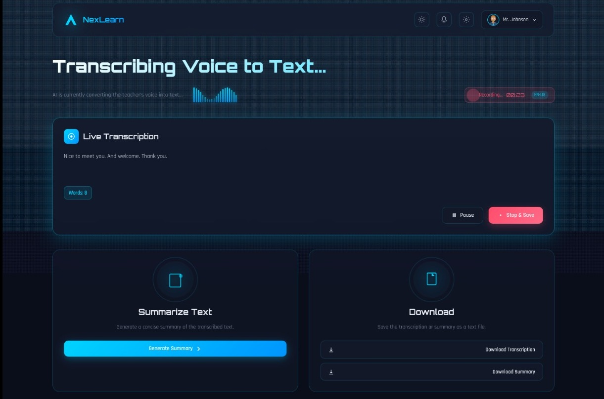

<div align="center">


# NexLearn — AI Voice Transcription System

**Real-time speech-to-text for classrooms, powered by Deepgram Nova-3 and Flask.**

Capture a teacher's voice through the browser. Watch it transcribe live. Download it instantly.

<br/>

[](https://your-render-url.onrender.com)
[](https://youtu.be/3a2gZvGKZvU)
[](https://medium.com/your-article-link)
[](LICENSE)


## Table of Contents

- [Overview](#overview)
- [Features](#features)
- [Demo](#demo)
- [Tech Stack](#tech-stack)
- [Architecture](#architecture)
- [Project Structure](#project-structure)
- [Getting Started](#getting-started)
- [Environment Variables](#environment-variables)
- [API & Socket Events](#api--socket-events)
- [Known Limitations & Roadmap](#known-limitations--roadmap)
- [Contributing](#contributing)
- [Support](#support)
- [License](#license)

---

## Overview

NexLearn is a web application that converts live speech into text in real time — built specifically for the classroom. A teacher speaks, students see the words appear on screen instantly. No file uploads, no post-processing delays, no third-party apps to install.

Under the hood, audio captured by the browser's `MediaRecorder` API is streamed in WebM chunks to a Flask/Socket.IO backend, which forwards it over a persistent WebSocket to Deepgram's Nova-3 model. Transcription results stream back within milliseconds and are broadcast to the client live.

> Built as part of an EdTech project exploring how AI can reduce accessibility barriers in education.

---

## Features

| Feature | Description |
|---|---|
| 🎙 **Live Transcription** | Audio streams from browser to Deepgram via WebSocket — words appear within seconds |
| ⚡ **Interim + Final Results** | Interim results show words as detected; finals lock in with punctuation and smart formatting |
| 🌍 **Auto Language Detection** | Deepgram detects spoken language automatically and displays it as a live badge |
| ⏸ **Pause / Resume** | Pause and resume recording mid-session without losing any transcribed text |
| ⏱ **Two-Phase Timer** | A connecting clock tracks handshake time; a separate recording timer starts from zero once live |
| 📋 **Summary Generation** | Generate a concise summary of the transcribed text on demand |
| 💾 **One-Click Download** | Export full transcription or summary as `.txt` directly from the browser |
| 👥 **Multi-Client Sessions** | Each browser tab is an isolated session — multiple users can record simultaneously |
| 🌌 **Animated UI** | Starfield background, audio visualizer bars, glowing cards, and smooth CSS transitions |

---

## Demo

### 📺 Video Walkthrough
> [Watch on YouTube →](https://youtu.be/3a2gZvGKZvU)

### 📸 Screenshot




## Tech Stack

| Layer | Technology | Purpose |
|---|---|---|
| Backend | Python 3.10+, Flask | HTTP server and routing |
| Real-time | Flask-SocketIO, Gevent | Bidirectional WebSocket events |
| Transcription | Deepgram Nova-3 | Live speech-to-text AI model |
| Audio Capture | Browser MediaRecorder API | WebM/Opus audio stream from mic |
| Frontend | Vanilla JS, Socket.IO client | UI logic and socket communication |
| Styling | CSS3 with custom properties | Animations, theming, responsive layout |

---

## Architecture

```
Browser (Client)
│
│  MediaRecorder → WebM chunks (every 2s)
│  Socket.IO (websocket transport)
│
▼
Flask Server (app.py)
│
│  Per-session store (in-memory dict)
│  Background thread per recording session
│
▼
DeepgramSession (features.py)
│
│  asyncio event loop in dedicated thread
│  Persistent WebSocket (wss://api.deepgram.com)
│  Nova-3 model, WebM/Opus auto-detect
│
▼
Deepgram API
│
│  Streams back interim + final transcripts
│
▼
Flask Server → Socket.IO emit → Browser UI
```

**Key design decision — EBML header prepending:**
The browser's `MediaRecorder` only includes the WebM container header in the first chunk. Deepgram requires a valid WebM stream for every chunk it receives. The server saves the first chunk's header and prepends it to all subsequent chunks before forwarding — this is what makes streaming work reliably without ffmpeg.

---

## Project Structure

```
NexLearn/
├── app.py                  # Flask server, Socket.IO handlers, session management
├── features.py             # DeepgramSession — asyncio WebSocket lifecycle
├── template/
|   └── static/
|     ├── css/
|     │   └── style.css       # Styles, animations, CSS variables, responsive layout
|     └── js/
|         └── script.js       # Socket.IO client, recording state machine, UI logic
├── templates/
│   └── index.html          # Single-page UI (Jinja2 template)
├── test.py                 # Standalone local mic test — no browser needed
├── requirements.txt        # Python dependencies
├── .env/                   # Environment variable
├── .gitignore
└── README.md
```

---

## Getting Started

### Prerequisites

- Python 3.10 or higher
- A [Deepgram account](https://console.deepgram.com) — the free tier includes enough credits to get started
- A modern browser (Chrome or Edge recommended for best `MediaRecorder` support)

### 1. Clone the repository

```bash
git clone https://github.com/fachiny17/NexLearn.git
cd nexlearn
```

### 2. Create and activate a virtual environment

```bash
# macOS / Linux
python3 -m venv venv
source venv/bin/activate

# Windows
python3 -m venv venv
venv\Scripts\activate
```

### 3. Install dependencies

```bash
pip install -r requirements.txt
```

### 4. Configure environment variables

```bash
cp .env.example .env
```

Edit `.env` and add your Deepgram API key:

```env
DEEPGRAM_API_KEY=your_deepgram_api_key_here
```

Get your key at [console.deepgram.com](https://console.deepgram.com) → API Keys → Create a New Key.

### 5. Run the development server

```bash
python3 app.py
```

Open `http://localhost:5000` in your browser. Allow microphone access when prompted and click **Start Recording**.

### 6. (Optional) Test transcription without a browser

```bash
python3 test.py
```

Speaks into your system microphone directly. Press `Ctrl+C` to stop. Useful for verifying your API key and network connection independently of the web UI.

---

## Deployment

### Render (Recommended)

1. Push the project to a GitHub repository.
2. Go to [render.com](https://render.com) → New → Web Service → connect your repository.
3. Configure the service:

| Setting | Value |
|---|---|
| **Runtime** | Python 3 |
| **Build Command** | `pip install -r requirements.txt` |
| **Start Command** | `gunicorn -k gevent -w 1 app:app` |

4. Under **Environment**, add:

```
DEEPGRAM_API_KEY=your_deepgram_api_key_here
```

5. Click **Deploy**.

> ⚠️ **Critical:** Always use `gunicorn -k gevent -w 1`. Socket.IO requires a single gevent worker — multiple workers will cause WebSocket connections to silently fail because different workers do not share the same in-memory session store.

### Other Platforms

The app runs on any platform that supports Python and WebSockets (Railway, Fly.io, VPS, etc.). The same gunicorn command applies. Make sure port `5000` (or your `PORT` env variable) is exposed.

---

## Environment Variables

| Variable | Required | Default | Description |
|---|---|---|---|
| `DEEPGRAM_API_KEY` | ✅ Yes | — | API key from [console.deepgram.com](https://console.deepgram.com) |
| `PORT` | ❌ No | `5000` | Port the server listens on |

---

## API & Socket Events

NexLearn communicates entirely over Socket.IO. Here is the full event reference:

### Client → Server

| Event | Payload | Description |
|---|---|---|
| `start_recording` | — | Initiates a Deepgram session for this client |
| `stop_recording` | — | Closes the Deepgram session and returns final text |
| `pause_recording` | — | Pauses audio forwarding |
| `resume_recording` | — | Resumes audio forwarding |
| `audio_chunk` | `bytes` | Raw WebM audio chunk from `MediaRecorder` |
| `generate_summary` | — | Triggers summary generation from current transcript |
| `download_transcription` | — | Requests transcription text for client-side download |
| `download_summary` | — | Requests summary text for client-side download |

### Server → Client

| Event | Payload | Description |
|---|---|---|
| `connected` | `{ session_id }` | Confirms socket connection |
| `recording_started` | `{ status: 'success' \| 'error' }` | Deepgram handshake result |
| `recording_stopped` | `{ full_text, language }` | Final transcript on stop |
| `transcription_update` | `{ text, full_text, language, is_final }` | Live transcript update |
| `recording_paused` | `{ status }` | Pause confirmed |
| `recording_resumed` | `{ status }` | Resume confirmed |
| `summary_result` | `{ success, summary?, error? }` | Summary result |
| `download_data` | `{ success, content, filename }` | File content for download |

---

## Known Limitations & Roadmap

### Current Limitations

- **Extractive summaries only** — The current summary is the first 5 sentences of the transcript. It is a placeholder. Replace the `generate_summary` handler in `app.py` with an LLM call (OpenAI, Anthropic, etc.) for real AI summarization.
- **In-memory sessions** — All session data lives in a Python dict. Restarting the server wipes all transcriptions. A database (Redis, PostgreSQL) would be needed for persistence.
- **Single language per session** — The language is set at session start. Switching mid-recording is not currently supported.
- **Free tier cold starts** — Free Render instances spin down after inactivity. The first request after a dormant period can take up to 60 seconds.

### Roadmap

- [ ] LLM-powered smart summaries (OpenAI / Anthropic)
- [ ] Persistent storage — save transcriptions to a database
- [ ] User accounts and session history
- [ ] Export to PDF and DOCX
- [ ] Speaker diarization — identify who is speaking
- [ ] Real-time collaborative view for students
- [ ] Keyword highlighting and topic extraction

---

## Contributing

Contributions are welcome and appreciated. Here is how to get involved:

### Reporting Bugs

Open an issue on GitHub with:
- A clear description of the bug
- Steps to reproduce it
- What you expected vs what actually happened
- Your OS, browser, and Python version

### Suggesting Features

Open an issue with the `enhancement` label. Describe the feature and the problem it solves.

### Submitting a Pull Request

1. Fork the repository
2. Create a feature branch:
   ```bash
   git checkout -b feat/your-feature-name
   ```
3. Make your changes and commit using [Conventional Commits](https://www.conventionalcommits.org):
   ```bash
   git commit -m "feat: add PDF export for transcriptions"
   ```
4. Push to your fork:
   ```bash
   git push origin feat/your-feature-name
   ```
5. Open a Pull Request against `main`

Please keep PRs focused — one feature or fix per PR makes review much faster.

---

## Support

If you run into issues or have questions:

- 🐛 **GitHub Issues** — [Open an issue](https://github.com/fachiny17/NexLearn/issues) for bugs and feature requests
- 📝 **Medium Article** — [Read the full build walkthrough](https://medium.com/your-article-link) for a deep dive into how NexLearn was built
- 📺 **YouTube** — [Watch the demo](https://youtu.be/3a2gZvGKZvU) to see the app in action

If NexLearn helped you or your project, consider giving the repo a ⭐ — it helps others find it.

---

## License

This project is licensed under the [MIT License](LICENSE) — free to use, modify, and distribute with attribution.

---

<div align="center">

Built by [Chisom](https://github.com/fachiny17) &nbsp;·&nbsp; Powered by [Deepgram](https://deepgram.com) &nbsp;·&nbsp; Deployed on [Render](https://render.com)

</div>